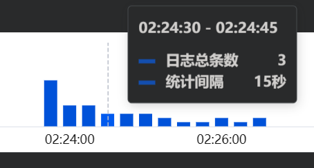

<h1 align="center" style="margin: 10px 0 10px; font-weight: bold;">Laravel队列应用场景-系列教程</h1>
<p align="center">
<a href="#"></a>
<a href="#"></a>
</p>

## 应用场景

### 阶梯降频轮询

例如有这样的场景，某电商系统的订单支付状态需要和上游的支付系统保持实时同步，需要每秒检查一次订单状态，如果订单状态为未支付，则继续检查，直到订单已完成。

然而针对每一笔订单，每秒检查一次会对服务器和上游API造成很大的负载。

如果我们能**动态调整检查频率**，比如前五次尝试中每1秒检查一次订单状态， 然后在接下来的五次尝试中每5秒检查一次，依此类推。这样**既能减少服务器和外部API的负载，又能确保及时更新**。

我们给他起个名字叫做**阶梯降频轮询**。

真实的例子比如对接支付宝时，支付成功的异步通知会逐渐减低回调频次通知调用方。

> 支付宝文档示例
> 
> 在进行异步通知交互时，如果支付宝收到的应答不是 success ，支付宝会认为通知失败，会通过一定的策略定期重新发起通知。通知的间隔频率为：4m、10m、10m、1h、2h、6h、15h。

本教程将带您一步步实现秒级别的阶梯降频轮询出队列方案。

实际效果：

<p>
    
</p>
<p>
    
</p>

#### 1. 项目初始化
```shell
composer install
```

#### 2. 配置 .env
```shell
cp .env.example .env
```

#### 3. 生成 key
```shell
php artisan key:generate
```

#### 4. 数据库准备
```shell
# 创建表结构
php artisan migrate

# 插入测试数据
php artisan db:seed
```

#### 5. 测试出队列效果
```shell
# 先开始队列监听worker
php artisan queue:work --sleep=1

# 开一个新的终端窗口，执行测试命令，这个命令会发送一条消息到队列
php artisan app:test
```

#### 6. 查看队列执行情况
```shell
# 打开日志，查看队列执行情况
tail -f storage/logs/laravel.log
```
